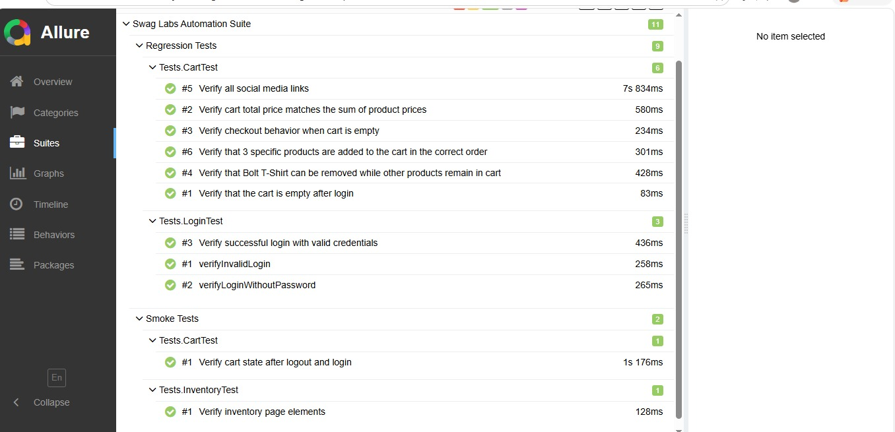

# Swag Labs Automation Project

## Overview

This project is a UI automation testing framework developed for the **Swag Labs** web application.

The framework automates key user flows using **Selenium WebDriver, Java, and TestNG**. It follows the **Page Object Model (POM)** design pattern to provide a clean, maintainable, reusable, and scalable automation structure.

The project also uses:

- JSON-based test data
- TestNG test execution
- Test grouping
- Explicit waits
- WebDriverManager
- Custom WebDriver Listener
- Allure Reporting
- Maven

### Application Under Test

**Swag Labs**

https://www.saucedemo.com/

---

# Technologies & Tools

- **Java**
- **Selenium WebDriver 4.39.0**
- **TestNG 7.10.2**
- **Maven**
- **Allure Report**
- **WebDriverManager**
- **JSON**
- **Git & GitHub**
- **IntelliJ IDEA**

---

# Framework Design

The project follows the **Page Object Model (POM)** design pattern.

The framework separates:

- Test cases
- Page objects
- Common page actions
- Test data
- WebDriver configuration
- Listeners
- Utility classes
- Reporting

### Benefits

- Improves code readability.
- Reduces code duplication.
- Makes locators easier to maintain.
- Provides reusable page methods.
- Separates test logic from UI implementation.
- Makes the framework easier to maintain and scale.

---

# Project Structure

```text
SwagLabsAutomationAssignment
│
├── .idea/
├── .mvn/
│
├── docs/
│   └── allure-report.jpeg
│
├── reports/
│   └── index.html
│
├── src/
│   │
│   ├── main/
│   │   │
│   │   ├── java/
│   │   │   │
│   │   │   ├── Base/
│   │   │   │   └── BasePages.java
│   │   │   │
│   │   │   ├── Pages/
│   │   │   │   ├── LoginPage.java
│   │   │   │   ├── InventoryPage.java
│   │   │   │   ├── CartPage.java
│   │   │   │   └── CheckoutPage.java
│   │   │   │
│   │   │   └── Utilities/
│   │   │       ├── CustomWebDriverListener.java
│   │   │       └── DataDriven.java
│   │   │
│   │   └── resources/
│   │       └── testData.json
│   │
│   └── test/
│       │
│       └── java/
│           │
│           ├── Base/
│           │
│           ├── Listeners/
│           │
│           │
│           ├── Tests/
│           │   ├── LoginTest.java
│           │   ├── InventoryTest.java
│           │   └── CartTest.java
│           │
│           └── Utilities/
│               ├── CMDRunner.java
│               └── ScreenshotUtils.java
│
├── target/
│
├── .gitignore
├── pom.xml
├── runner.xml
└── README.md
```

---

# Automated Test Coverage

## Login Feature

The following login scenarios are automated:

- ✅ Verify successful login with valid credentials.
- ✅ Verify login with invalid username/password.
- ✅ Verify login behavior with missing credentials.

---

## Inventory Feature

The Inventory feature covers:

- ✅ Verify successful navigation to the Inventory page.
- ✅ Verify Inventory page title.
- ✅ Verify products are displayed.
- ✅ Verify shopping cart icon is displayed.
- ✅ Verify the number of products displayed.

---

## Cart Feature

The Cart feature covers:

- ✅ Verify that the cart is empty after login.
- ✅ Verify products can be added to the cart.
- ✅ Verify products are displayed correctly in the cart.
- ✅ Verify product order.
- ✅ Verify a product can be removed from the cart.
- ✅ Verify other products remain after removing a product.
- ✅ Verify cart total price.
- ✅ Verify cart state after logout and login.
- ✅ Verify checkout behavior with an empty cart.

---

## Checkout Feature

The Checkout page object is implemented to support checkout-related automation scenarios.

The `CheckoutPage` is responsible for interactions such as:

- Entering checkout information.
- Navigating through the checkout process.
- Validating checkout-related behavior.
- Completing checkout actions.

---

# Test Data Management

Test data is stored externally in a JSON file:

```text
src/main/resources/testData.json
```

This separates test data from the automation logic.

The JSON test data can contain:

- Valid login credentials
- Invalid login credentials
- Empty or missing credentials
- Product-related test data
- Other required test inputs

### Example

```json
{
  "validUser": {
    "username": "standard_user",
    "password": "secret_sauce"
  }
}
```

Using external test data makes the framework easier to maintain and allows test data to be changed without modifying the test classes.

---

# TestNG

The project uses **TestNG** as the test execution framework.

TestNG is used for:

- Test execution
- Assertions
- Test organization
- Test grouping
- Setup and teardown
- Test reporting

The test execution configuration is maintained in:

```text
runner.xml
```

The XML configuration can be used to control which tests or groups are executed.

---

# Test Execution

## Run Using IntelliJ IDEA

1. Open the project in IntelliJ IDEA.
2. Make sure Maven dependencies are installed.
3. Make sure the required JDK is configured.
4. Open `runner.xml`.
5. Run the configured TestNG suite.

---

## Run Using Maven

Clean and build the project:

```bash
mvn clean install
```

Run the tests:

```bash
mvn test
```

---

# Page Object Model

The framework contains separate Page Object classes for the application's main pages.

## LoginPage

Responsible for:

- Entering username.
- Entering password.
- Clicking the Login button.
- Retrieving login error messages.
- Performing login actions.

---

## InventoryPage

Responsible for:

- Validating the Inventory page.
- Validating inventory elements.
- Managing products.
- Opening the shopping cart.
- Performing inventory-related actions.

---

## CartPage

Responsible for:

- Validating cart items.
- Getting cart item information.
- Removing products.
- Validating product order.
- Validating cart totals.
- Navigating to checkout.

---

## CheckoutPage

Responsible for:

- Entering checkout information.
- Performing checkout actions.
- Validating checkout behavior.
- Completing checkout-related steps.

---

# Base Classes

The framework contains reusable base classes to avoid duplicated WebDriver and page interaction logic.

## BasePages

`BasePages` provides reusable methods for common Selenium operations such as:

- Clicking elements
- Entering text
- Retrieving element text
- Checking element visibility
- Waiting for elements
- Handling browser interactions

This allows Page Object classes to focus on page-specific functionality.

---

# Utilities

The framework contains utility classes for reusable functionality.

## DataDriven

`DataDriven` is responsible for reading test data from the JSON file.

Test data is maintained separately from test logic to support data-driven testing.

---

## CustomWebDriverListener

`CustomWebDriverListener` is used to listen to WebDriver events during test execution.

It helps provide additional information about browser actions and test execution.

---

## ScreenshotUtils

`ScreenshotUtils` provides screenshot functionality that can be used during test execution, especially when a test fails.

Screenshots help with:

- Debugging failures
- Investigating unexpected behavior
- Reporting
- Test documentation

---

## CMDRunner

`CMDRunner` is used to execute required command-line operations related to the project and reporting workflow.

---

# Synchronization

The framework uses Selenium's **explicit waits** through `WebDriverWait`.

Explicit waits are used when elements may require additional time to become:

- Visible
- Clickable
- Present in the DOM

This helps reduce flaky test execution and improves test stability.

---

# WebDriver Management

The project uses **WebDriverManager** to manage browser drivers.

This eliminates the need to manually configure the ChromeDriver executable.

The automation is executed using:

- Google Chrome
- Selenium WebDriver
- WebDriverManager

---

# Assertions

The project uses **TestNG assertions** to validate expected application behavior.

Examples of validations include:

- Page URL
- Page title
- Element visibility
- Product count
- Cart item count
- Product order
- Product removal
- Cart total price
- Login error messages
- Checkout behavior
- Cart state

Assertions ensure that the actual application behavior matches the expected result.

---

# Reporting

The project uses **Allure Report** for test execution reporting.

Allure provides detailed information about:

- Test execution status
- Test suites
- Test cases
- Test steps
- Test duration
- Passed tests
- Failed tests
- Failure details
- Screenshots when configured

---

## Allure Report

The project contains an Allure report output under:

```text
reports/index.html
```

A screenshot of the generated Allure report is also included in:

```text
docs/allure-report.jpeg
```

### Allure Report Preview



---

# Test Execution Report

The generated report provides an overview of the executed automation tests, including:

- Total tests
- Passed tests
- Failed tests
- Test duration
- Test cases
- Test steps
- Failure information
- Screenshots

The report can be opened from:

```text
reports/index.html
```

---

# Smoke Tests

Smoke testing focuses on critical application functionality to verify that the main application flow is working correctly.

The project uses TestNG groups to organize tests such as:

- Login
- Inventory
- Cart

The exact tests included in each group are controlled through `runner.xml`.

---

# Regression Tests

Regression testing covers a broader range of application functionality.

The regression suite can include scenarios related to:

### Login

- Valid login
- Invalid login
- Missing credentials

### Inventory

- Inventory page validation
- Product validation
- Cart navigation

### Cart

- Empty cart
- Adding products
- Removing products
- Product order
- Cart total
- Cart state

### Checkout

- Checkout information
- Checkout navigation
- Checkout validation

---

# Maven

The project uses **Maven** for dependency management and project build automation.

The main Maven configuration is located in:

```text
pom.xml
```

Maven is responsible for managing project dependencies such as:

- Selenium WebDriver
- TestNG
- WebDriverManager
- Allure
- JSON-related libraries

---

# Git & GitHub

Git is used for version control and project management.

The repository contains:

- Automation source code
- Test classes
- Page Objects
- Utilities
- Test data
- TestNG configuration
- Maven configuration
- Reporting documentation
- README documentation

---

# Git Ignore

Generated files and IDE-specific files should not be committed to the repository.

Examples include:

```text
.idea/
target/
*.iml
```

Depending on the reporting workflow, generated Allure result files can also be excluded:

```text
allure-results/
```

---

# Project Goals

The main goals of this project are to demonstrate practical knowledge of:

- ✅ Manual and automation testing concepts
- ✅ Selenium WebDriver
- ✅ Java
- ✅ TestNG
- ✅ Page Object Model
- ✅ Data-driven testing
- ✅ JSON test data
- ✅ Explicit waits
- ✅ Assertions
- ✅ Test grouping
- ✅ Maven
- ✅ WebDriverManager
- ✅ WebDriver Listeners
- ✅ Screenshot handling
- ✅ Allure Reporting
- ✅ Git and GitHub

---

# Application Under Test

**Swag Labs**

https://www.saucedemo.com/

Swag Labs is a demo e-commerce application used for practicing software testing and UI automation.

The application provides common e-commerce workflows including:

- User login
- Product inventory
- Shopping cart
- Product removal
- Checkout

---

# Author

**Sara Ali**

Software Testing / QA Automation
